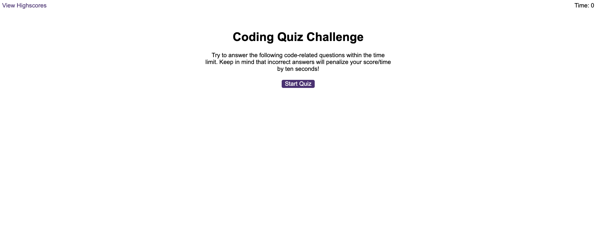
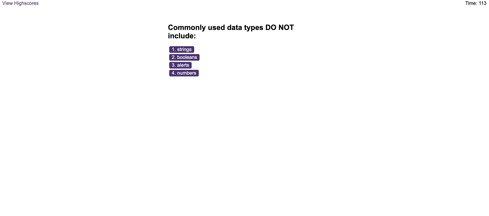
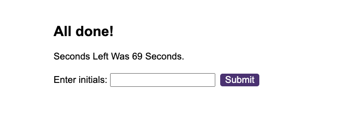
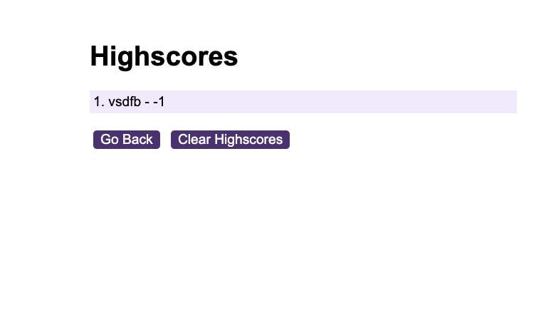
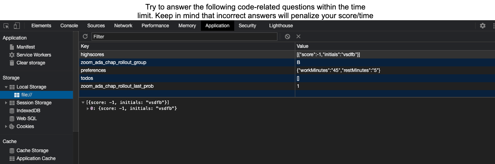

# Code-Quiz-GT

<!-- https://dagreatcode.github.io/Web-APIs-Code-Quiz-gt/ -->

[](https://dagreatcode.github.io/Web-APIs-Code-Quiz-gt/)


[](https://github.com/dagreatcode?tab=followers)


## Acceptance Criteria

```
GIVEN I am taking a code quiz
WHEN I click the start button
THEN a timer starts and I am presented with a question
WHEN I answer a question
THEN I am presented with another question
WHEN I answer a question incorrectly
THEN time is subtracted from the clock
WHEN all questions are answered or the timer reaches 0
THEN the game is over
WHEN the game is over
THEN I can save my initials and score
```

## User Story

```
AS A coding bootcamp student
I WANT to take a timed quiz on JavaScript fundamentals that stores high scores
SO THAT I can gauge my progress compared to my peers
```

CodeQuiz WebSite

https://dagreatcode.github.io/Web-APIs-Code-Quiz-gt/

Repo

https://github.com/dagreatcode/Web-APIs-Code-Quiz-gt.git

Wow This was fun...
I was having a tough time but i learned a lot of things..


In this image, I had my count down working but I got it working.


## This is where the DOM was Manipulated. 


### This is where I inserted the answers in the buttons. And the DOM was Manipulated for the questions. 


### This information is saved in the client side for the user to keep up with a high score.


### The high score is put into the local storage 



### This is the Local Storage... FYI Indexed DB is there for other options.


<br/>
<br/>
<br/>
<br/>

Here Is A Demo

Thanks For Taking A Look....